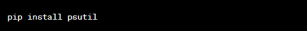

# Application Power Consumption Estimation
This Python script allows you to estimate the power consumption of a single application using CPU-based heuristics. The script measures the difference in system-wide power consumption before and after running the target application and calculates the estimated power consumption based on CPU usage.

# Prerequisites
1.Have Python installed on your system.

You can Install python from its website:-

https://www.python.org/downloads/

2.Install the required psutil library using the provided pip command.

3.Run the Scripts with the following prompts.

pip install psutil

# How it works
1.The script prompts you to enter the name of the target application you want to measure.

2.Next, it asks for the measurement duration in seconds. The longer the duration, the more accurate the estimation.

3.The script then measures the system-wide power consumption before and after running the target application for the specified duration.

4.It calculates the estimated power consumption by considering the difference in system-wide power and CPU usage during the measurement period.

5.The estimated power consumption of the target application is displayed in watts.

-> Note: The accuracy of the estimation may vary depending on the system and CPU capabilities. Also, the power consumption measurement on Windows might be limited compared to macOS and Linux systems.

Below is an example.

.png>)

# License
This script is provided under the MIT License. Feel free to use and modify it according to your needs.